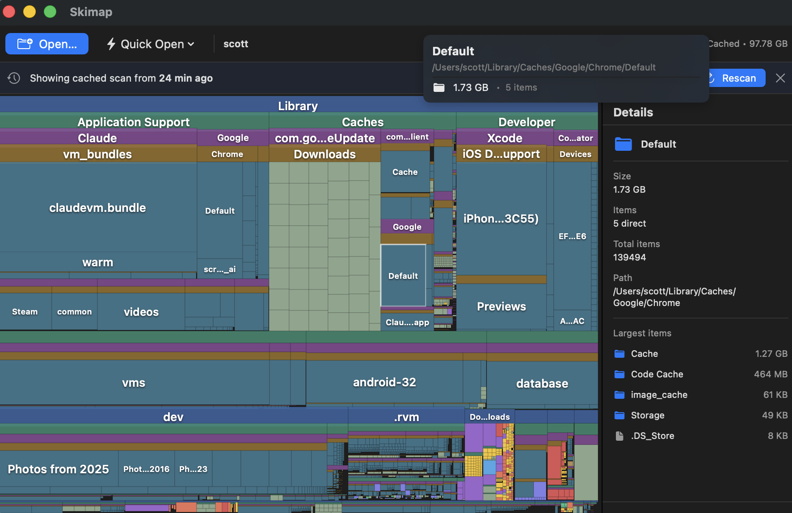

# Skimap

A macOS app that scans your disk and visualises storage usage as an interactive treemap.



## Features

- **Squarified treemap** — files and folders are drawn as proportional rectangles, sized by disk usage, with aspect ratios optimised for readability
- **Colour-coded by file type** — video, audio, images, archives, code, documents, and more each have a distinct colour
- **Drill-down navigation** — double-click any folder tile or use the Zoom In button to explore deeper; breadcrumb bar to navigate back
- **Hover tooltips** — shows full path, size, and item count
- **Detail panel** — lists the largest items in the selected folder
- **Scan caching** — results are saved to disk and loaded instantly on reopen, with a Rescan button to refresh
- **Quick Open shortcuts** — one-click access to Home, Downloads, Documents, Desktop, Applications

## Requirements

- macOS 13 Ventura or later
- Xcode 15+

## Building

```bash
git clone https://github.com/sco11morgan/skimap.git
cd skimap
open Skimap.xcodeproj
```

Then press **⌘R** to build and run. No dependencies, no package manager.

> **Note:** To scan folders outside your home directory you may need to set a Development Team under *Signing & Capabilities* in the project settings.

## Usage

| Action | Result |
|---|---|
| **Open…** or **Quick Open** | Choose a folder to scan |
| **Click** a tile | Select and show details in the side panel |
| **Double-click** a folder tile | Zoom in to that folder |
| **Hover** a tile | Show tooltip with path and size |
| **Up** button | Navigate one level up |
| **Rescan** (cache banner) | Run a fresh scan of the same folder |

Files smaller than 1 MB are rendered but not interactive, keeping focus on the items that matter.

## Releasing

Releases are built with `make` and published via the `gh` CLI.

**1. Tag the commit**
```bash
git tag v1.0.0
git push origin v1.0.0
```

**2. Build and publish**
```bash
make release VERSION=1.0.0
```

This will archive the project in Release configuration, export a signed `.app`, zip it, and create a GitHub release with auto-generated notes from commits since the last tag. The zip is saved to `build/Skimap-<version>.zip`.

To build a zip locally without publishing:
```bash
make zip VERSION=1.0.0
```

> **Note:** Because the app is not notarised, macOS Gatekeeper will block it on first launch. Users can right-click → **Open** to bypass this once.

## Scan cache

Scan results are cached to disk so reopening the same folder is instant. The cache lives at:

```
~/Library/Caches/com.skimap.app/
```

Each scanned path gets its own JSON file (named by a hash of the path). The cache is never included in the app bundle — it is created and managed entirely on the user's machine. It is safe to delete at any time; the app will re-scan from scratch on next open.

## Project structure

```
Skimap/Sources/
├── SkimapApp.swift        — app entry point
├── ContentView.swift      — toolbar, breadcrumb, detail panel
├── TreeMapView.swift      — SwiftUI treemap + tile rendering
├── TreeMapLayout.swift    — squarified layout algorithm
├── FileNode.swift         — data model + Codable for caching
├── DiskScanner.swift      — async file system scanner
└── ScanCache.swift        — on-disk JSON cache
```

## License

MIT
